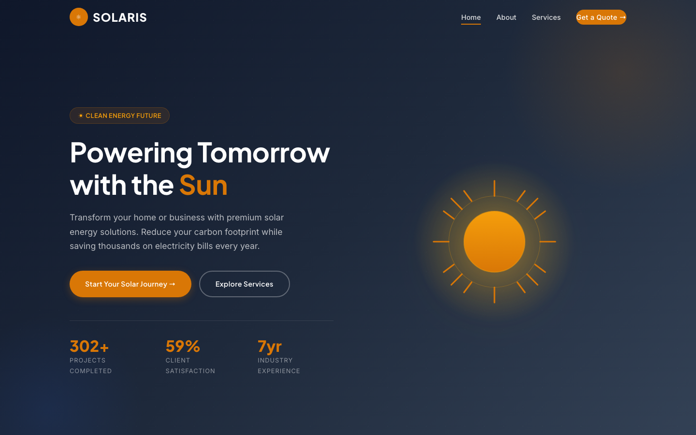

# SOLARIS — Solar Energy HTML Template

A premium, framework-free HTML template for solar installers, renewable-energy companies, and clean-tech startups. SOLARIS pairs a warm amber accent with a deep navy palette to communicate power, efficiency, and sustainability.

## 📸 Screenshot

## 🎨 Design System

| Token | Value | Usage |
|-------|-------|-------|
| `--amber` | `#D97706` | Primary accent, CTAs, highlights |
| `--amber-light` | `#F59E0B` | Hover states, sun imagery |
| `--navy` | `#1E293B` | Backgrounds, headings, footer |
| `--navy-dark` | `#0F172A` | Dark surfaces |
| `--slate-light` | `#64748B` | Body text |
| `--green` | `#10B981` | Savings / success accents |
| Headings | Plus Jakarta Sans (400–800) | Confident display type |
| Body | Inter (400–600) | Clean geometric sans |

## 📄 Pages

| Page | Description | Sections |
|------|-------------|----------|
| [index.html](index.html) | Home | Hero with carousel, 4-step solar path, solutions (4), savings stats, testimonials, CTA |
| [about.html](about.html) | Company story | Decade of excellence, mission & vision, values, team, CTA |
| [services.html](services.html) | Offerings | Residential, commercial, battery storage, maintenance + FAQ accordion |
| [contact.html](contact.html) | Contact | Form (name, email, phone, message), contact info, CTA |

## ⚙️ Tech Stack

- **HTML5** — semantic markup, accessibility-first
- **CSS3** — custom properties, Grid, Flexbox, `clamp()`
- **Vanilla JS** — IntersectionObserver reveals, animated counters, carousel, FAQ toggles, contact-form validation
- **Fonts** — Google Fonts (Plus Jakarta Sans + Inter)
- No frameworks, no build step, no dependencies

## 📁 Images

All imagery lives in `assets/img/` — 22 files including solution icons (residential, commercial, storage, maintenance), carousel shots, product images, team portraits, and SVG backgrounds.

---

**Template by uiuxlabz** — framework-free, responsive, production-ready.

### Let's Build Something Together 🚀

[https://tally.so/r/q4q1L9](https://tally.so/r/q4q1L9)
